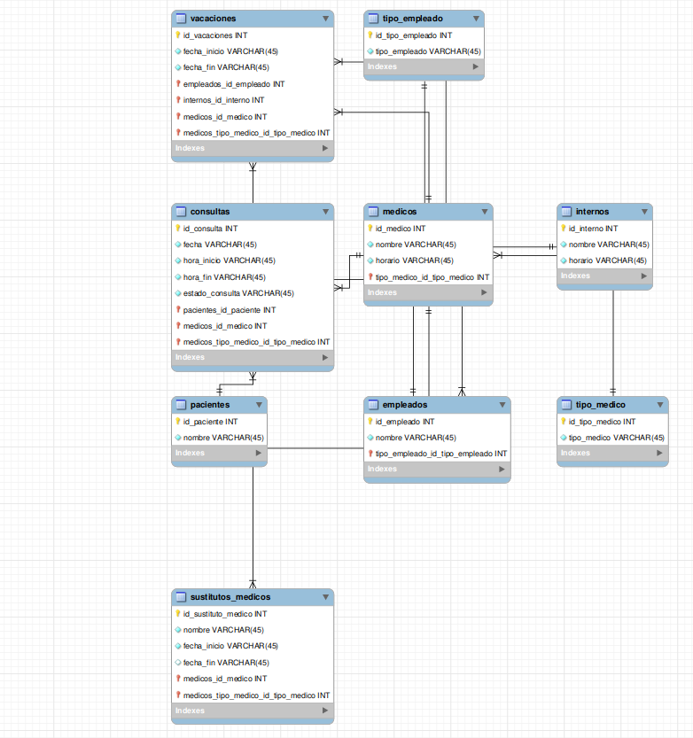

# 🚑 MediSistema 📊

Este proyecto consiste en una base de datos relacional que gestiona información sobre campeones, objetos, jugadores, partidas y más, relacionados con el videojuego **League of Legends**. La base de datos está diseñada en MySQL y contiene varias tablas interrelacionadas para almacenar datos importantes sobre el juego y su ecosistema.

## 📁 Estructura de la Base de Datos

La base de datos está compuesta por las siguientes tablas:

- **`medicos`**: Información sobre los distintos medicos.
- **`empleados`**: Información sobre los distintos empleados.
- **`consultas`**: Información sobre las distintas consultas.
- **`internos`**: Información sobre los distintos internos.
- **`pacientes`**: Información detallada sobre los pacientes.
- **`sustititos_medicos`**: Información sobre los distintos sustitutos.
- **`Tipo_empleado`**: Información sobre los distintos tipos de empleados.
- **`tipo_medico`**: Información sobre los distintos tipos de medicos.
- **`vacaciones`**: Información sobre las distintas fechas de vacaciones.

## 🚀 Instalación y Configuración

1. **Instalar MySQL** en tu sistema.
2. Crear el esquema de la base de datos usando el siguiente comando:
    ```sql
    CREATE SCHEMA IF NOT EXISTS `mydb` DEFAULT CHARACTER SET utf8;
    ```
3. Ejecutar el archivo SQL para crear todas las tablas de la base de datos.
4. Insertar los datos necesarios en las tablas correspondientes.

## 📈 Diagrama EER



## 📝 Consultas SQL Documentadas

A continuación se presentan algunas consultas útiles que puedes realizar en esta base de datos, junto con su explicación:

1. **Número de pacientes atendidos por cada médico**


```sql
SELECT medicos.nombre, COUNT(consultas.id_consulta) AS total_pacientes
FROM consultas
INNER JOIN medicos ON consultas.medicos_id_medico = medicos.id_medico
GROUP BY medicos.nombre;

```


2. **Total de días de vacaciones planificadas y disfrutadas por cada empleado**


```sql


```


3. **Médicos con mayor cantidad de horas de consulta en la semana**


```sql


```


4.  **Número de sustituciones realizadas por cada médico sustituto**


```sql


```


5.  **Número de médicos que están actualmente en sustitución**


```sql


```


6. **Horas totales de consulta por médico por día de la semana**


```sql


```


7.  **Médico con mayor cantidad de pacientes asignados**


```sql


```


8. **Empleados con más de 10 días de vacaciones disfrutadas**


```sql


```


9.  **Médicos que actualmente están realizando una sustitución**


```sql


```


10.  **Promedio de horas de consulta por médico por día de la semana**


```sql


```


11.  **Empleados con mayor número de pacientes atendidos por los médicos bajo su supervisión**


```sql


```


12.  **Médicos con más de 5 pacientes y total de horas de consulta en la semana**


```sql


```


13.  **Total de días de vacaciones planificadas y disfrutadas por cada tipo de empleado**


```sql


```


14. **Total de pacientes por cada tipo de médico**


```sql


```


15. **Total de horas de consulta por médico y día de la semana**


```sql


```


16. **Número de sustituciones por tipo de médico**


```sql


```


17. **Total de pacientes por médico y por provincia**


```sql


```


18. **Empleados y médicos con más de 20 días de vacaciones planificadas**


```sql


```


19. **Médicos con el mayor número de pacientes actualmente en sustitución**


```sql


```


20. **Total de horas de consulta por provincia y día de la semana**


```sql


```